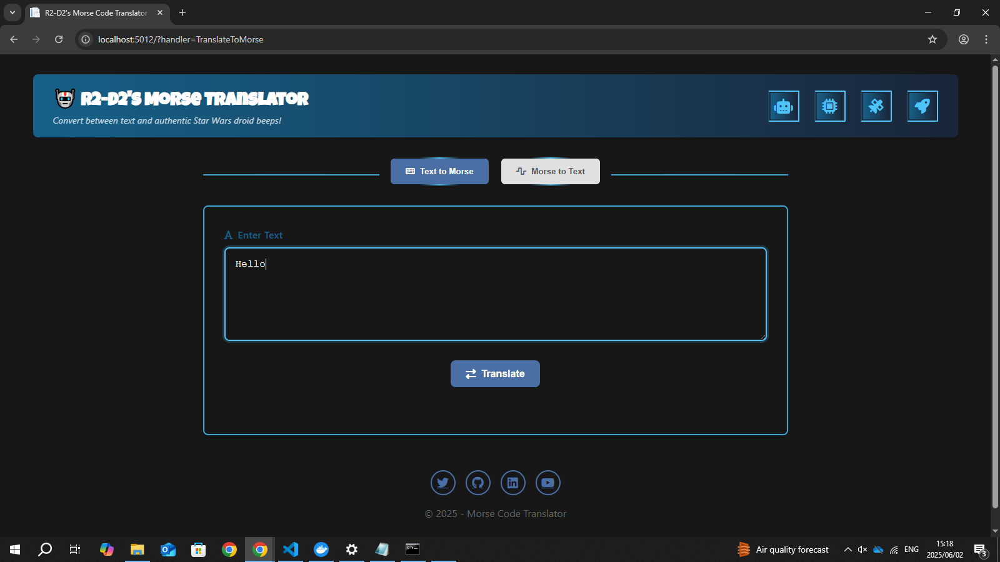
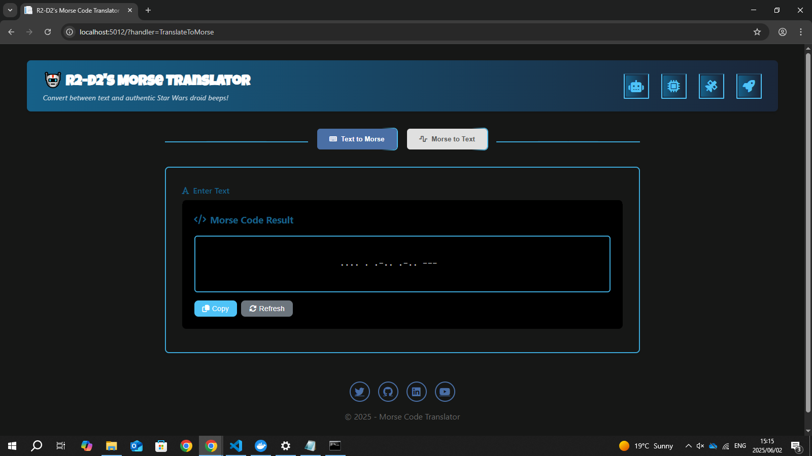

# 📡 R2-D2's Morse Code Translator 🤖
### A web-based Morse code translator built with ASP.NET Core(C#), that translates between plain text and Morse code with a fun R2-D2 inspired interface. Beep-boop! 🤖✨


## 📋 Prerequisites () => 

Before you begin, ensure you have the following installed/configured:

**🧰 Tools:**
- ⚙️ **.NET 8.0+** Required runtime for ASP.NET Core
- ⚙️ **Node.js 18+** For JavaScript execution in development
- ⚙️ **Visual Studio 2022 (Recommended)**  or VS Code with C# extensions


**📦 Included Dependencies:**
- 🎨 **Font Awesome** For icons
- 🖥️ **Razor Pages** For UI components

## ▶️ Getting Started  () => 

### 🛠️ Setup Instructions
1. **Clone the repository:**
   ```bash
   git clone https://github.com/Kutullo20/morse-code-translator.git
   cd morse-code-translator
2. **Run the application:**
   ```bash
   dotnet run  

## 🛠️ Built With  () => 

- **C# via ASP.NET Core** – The backbone of this translator (because .NET never fails!)
- **Razor Pages** – For dynamic, snappy UI updates
- **JavaScript + CSS** – For smooth animations & a droid-worthy experience
- **Font Awesome** – For those slick icons (even R2-D2 approves 👀)

## 🌟 Features () => 

- ✅ **Bidirectional Translation:** Convert plain text to Morse code and Morse code back to plain text
- ✅ **User-Friendly Interface:** Toggle between translation modes
- ✅ **Interactive Elements:**  Copy results to clipboard, Reset/refresh translations and Animated loading overlay with R2-D2 animation


## 🚀 Usage  () => 

**🔤 Text to Morse Code:**
- Select "Text to Morse" mode 📝
- Enter your text in the input box ✍️
- Click "Translate" ↔️ to convert to Morse code
- 📋 Copy the result using the copy button
  
**📟 Morse Code to Text:**
- ⚙️** Visual Studio 2022 (Recommended)**  or VS Code with C# extensions
- Select "Morse to Text" mode 📶
- Enter Morse code (use space between letters and / between words) ⌨️
- Click "Translate" ↔️ to convert to plain text
- 📋 Copy the result using the copy button  

## 🚀 Deployment Status: Live and Operational ✅  () => 
**The droid has landed on AWS! 🛰️🛸**
- We've successfully deployed to the cloud using AWS Elastic Beanstalk 🌩️
- You can now access the live version here 👉 http://development.eba-nw9pmeyj.eu-north-1.elasticbeanstalk.com/

**🙏 Special Thanks**
- A massive shoutout to Milan Jovanović for his clear and practical tutorial on deploying .NET Core apps to AWS!
- 📺 I followed his guide here: 👉 https://youtu.be/oCTeUkjkqHs?si=O97O__KTzJtDH_l7
- Without it, R2-D2 would still be overheating in dev mode. 💥🔧
## 📸 UI Preview  () => 





